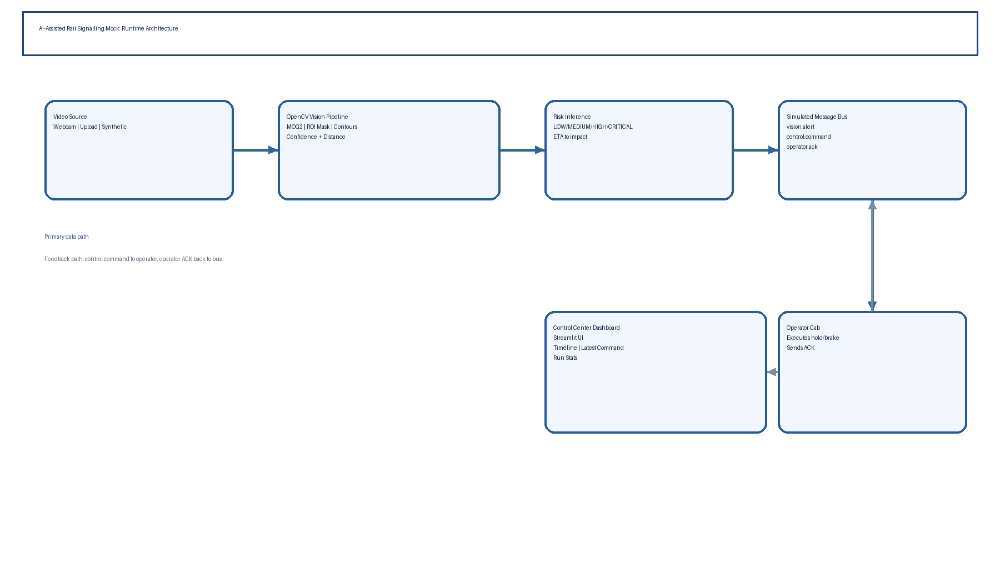

# System Architecture

## Purpose

This project demonstrates an AI-assisted rail signalling concept using a real-time computer vision pipeline and a simulated control-center message bus. It is intended for demonstration and discussion, not operational deployment.

## Diagram

## High-level components

1. `Video Source`
   - Webcam (`cv2.VideoCapture(0)`), uploaded video, or synthetic fallback.
2. `Vision Node`
   - OpenCV background subtraction and contour extraction in a rail ROI.
3. `Risk Engine`
   - Converts detection distance into risk tiers and estimated time-to-impact.
4. `Control Center`
   - Publishes dispatch commands using AI-assisted latency assumptions.
5. `Operator Channel`
   - Sends acknowledgement events back to control center.
6. `Dashboard`
   - Streamlit UI for controls, telemetry, message timeline, and latest command.

## Data flow

- `vision.alert`:
  - Producer: `vision-node`
  - Consumer: `control-center`
  - Purpose: report obstacle count, nearest distance, risk, ETA.
- `control.command`:
  - Producer: `control-center`
  - Consumer: `operator-cab`
  - Purpose: dispatch hold/brake or speed-reduction command.
- `operator.ack`:
  - Producer: `operator-cab`
  - Consumer: `control-center`
  - Purpose: command acknowledgement and execution state.

## Vision pipeline internals

Per frame:

1. Build track polygon mask in image space.
2. Foreground extraction with MOG2 background subtractor.
3. Denoise and morphology operations (`GaussianBlur`, threshold, open, dilate).
4. Keep only foreground inside rail corridor.
5. Find contours and filter by area threshold.
6. Convert contour area to confidence heuristic.
7. Estimate distance by vertical position in frame.
8. Draw overlays for operator-facing visualization.

## Runtime model

The app runs in a session-driven real-time loop:

- `Start real-time run` initializes source and session counters.
- One frame is processed per rerun.
- App calls `st.rerun()` at the end of each frame tick to continue streaming.
- `Stop real-time run` can interrupt immediately.
- Duration timeout auto-terminates and writes run statistics.

This model avoids long blocking loops and keeps controls responsive.

## Fault tolerance behavior

- If webcam cannot open: synthetic fallback starts automatically.
- If webcam returns repeated black frames: switches to synthetic stream.
- If uploaded video ends: run terminates gracefully.

## Security and safety posture

The implementation is intentionally minimal and does not include:

- operational interlocking,
- authenticated command transport,
- deterministic fail-safe state machines,
- formal verification/certification artifacts.

Treat this as a concept demonstrator only.
